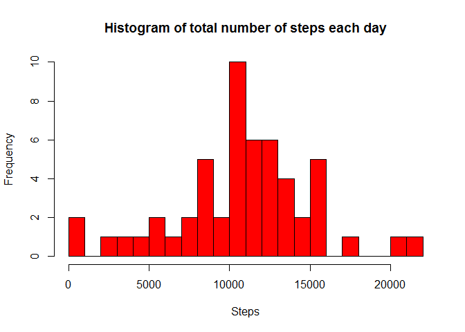
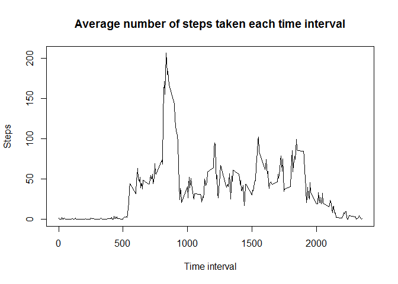
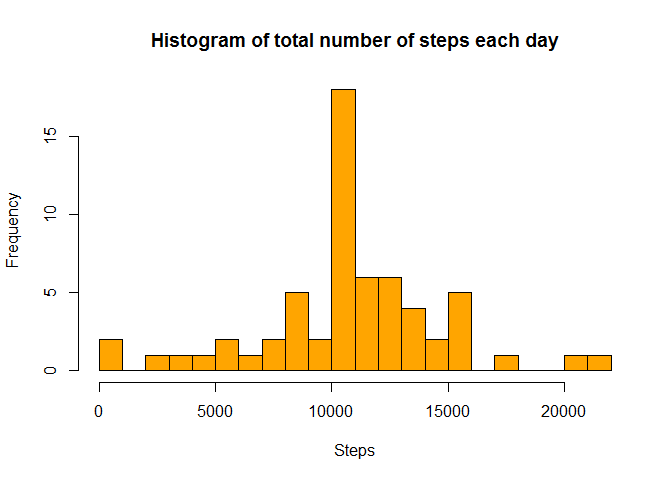
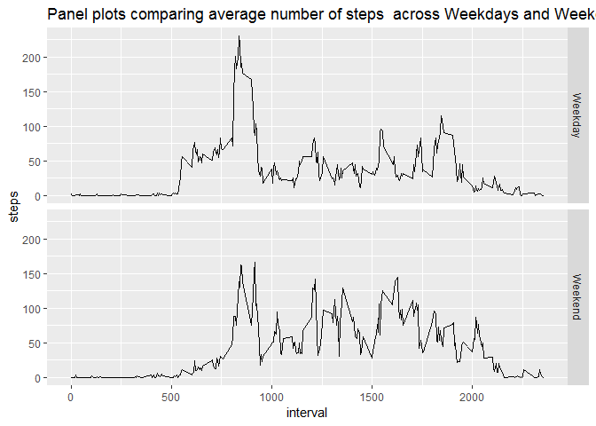

## Loading and Preprocessing the data


###1. The Reading and formatting of data


```r
file<-"activity.csv"
    if(!file.exists(file)){
        unzip("repdata%2Fdata%2Factivity.zip")
    }
    a<-read.csv(file)
    a$date<-as.Date(a$date, "%Y-%m-%d")
    summary(a)
```

```
##      steps             date               interval     
##  Min.   :  0.00   Min.   :2012-10-01   Min.   :   0.0  
##  1st Qu.:  0.00   1st Qu.:2012-10-16   1st Qu.: 588.8  
##  Median :  0.00   Median :2012-10-31   Median :1177.5  
##  Mean   : 37.38   Mean   :2012-10-31   Mean   :1177.5  
##  3rd Qu.: 12.00   3rd Qu.:2012-11-15   3rd Qu.:1766.2  
##  Max.   :806.00   Max.   :2012-11-30   Max.   :2355.0  
##  NA's   :2304
```


## What is mean total number of steps taken per day?


###2. Histogram of total number of steps taken each day


```r
    totstep<-with(a, aggregate(steps~date, FUN=sum, na.rm=TRUE))
    hist(totstep$steps, main="Histogram of total number of steps each day", xlab="Steps", col="red", breaks=20)
```

<!-- -->

```r
    fig<-dev.copy(png,'./figures/plot1.png')
    fig<-dev.off()
```


###3. Mean and median of number of steps taken each day


```r
    mnstep<-format(mean(totstep$steps), digits=7)
    medstep<-median(totstep$steps)
```

The mean of number of steps each day is 10766.19 and the median is 10765


## What is the average daily activity pattern?


###4. Time series plot of the avergae number of steps taken


```r
    avstep<-with(a, aggregate(steps~interval, FUN=mean, na.rm=TRUE))
    plot(avstep$interval, avstep$steps, type="l", main="Average number of steps taken each time interval", xlab="Time interval", ylab="Steps")
```

<!-- -->

```r
    fig<-dev.copy(png,'./figures/plot2.png')
    fig<-dev.off()
```


###5. The 5 min interval containing on average the maximum number of steps


```r
    tstep<-which(avstep$steps==max(avstep$steps))
    tstep<-avstep$interval[tstep]
```

The 5 min interval which contains, on an average, the maximum number of steps is 835


## Imputing missing values


```r
    missnum<-sum(is.na(a))
    missper<-format(100*mean(is.na(a)), digits=3)
```

The total number of missing data is 2304 which accounts for 4.37% of total data.


###6. Imputing of missing data

To impute the missing data, the average number of steps for each interval across all days from the available data is used to replace the missing steps for that particular interval.
It is done in following steps:


a. A data frame with only the non missing data is created:

```r
    b<-a[complete.cases(a),]
    head(b)
```

```
##     steps       date interval
## 289     0 2012-10-02        0
## 290     0 2012-10-02        5
## 291     0 2012-10-02       10
## 292     0 2012-10-02       15
## 293     0 2012-10-02       20
## 294     0 2012-10-02       25
```

b. The rows for the missing data is stored in a vector: 

```r
    c<-which(is.na(a$steps))
    head(c)
```

```
## [1] 1 2 3 4 5 6
```

c. Finally, the missing data in each row is replaced with the average steps for the corresponding interval:

```r
        for(i in 1:length(c)){
            a[c[i],1]<- avstep[which(avstep$interval==a[c[i],3]),2]
        }
    summary(a)
```

```
##      steps             date               interval     
##  Min.   :  0.00   Min.   :2012-10-01   Min.   :   0.0  
##  1st Qu.:  0.00   1st Qu.:2012-10-16   1st Qu.: 588.8  
##  Median :  0.00   Median :2012-10-31   Median :1177.5  
##  Mean   : 37.38   Mean   :2012-10-31   Mean   :1177.5  
##  3rd Qu.: 27.00   3rd Qu.:2012-11-15   3rd Qu.:1766.2  
##  Max.   :806.00   Max.   :2012-11-30   Max.   :2355.0
```

###7. Histogram of total number of steps taken each day with imputed missing data


```r
    totstep2<-with(a, aggregate(steps~date, FUN=sum))
    hist(totstep2$steps, main="Histogram of total number of steps each day", xlab="Steps", col="orange", breaks=20)
```

<!-- -->

```r
    mnstep2<-format(mean(totstep2$steps), digits=7)
    medstep2<-median(totstep2$steps)
    fig<-dev.copy(png,'./figures/plot3.png')
    fig<-dev.off()
```

The mean of number of steps each day is 10766.19 and the median is 1.0766189\times 10^{4}


## Are there differences in activity patterns between weekdays and weekends?


###8. Panel plot comparing the average number of steps taken per 5 min interval across weekdays and weekends.


```r
    a<-mutate(a,"day"= weekdays(a$date))
        for(i in 1: length(a$day)){
            if(a[i,4]=="Saturday"|a[i,4]=="Sunday"){
                a[i,4]<-"Weekend"
            }
            else{
                a[i,4]<-"Weekday"
            }
        }
    avstepday<-with(a, aggregate(steps~(interval+day), FUN=mean))
    ggplot(avstepday, aes(interval, steps))+facet_grid(day~.)+geom_line()+ggtitle("Panel plots comparing average number of steps  across Weekdays and Weekends")
```

<!-- -->

```r
    fig<-dev.copy(png,'./figures/plot4.png')
    fig<-dev.off()
```

